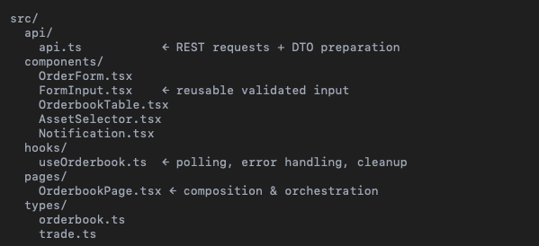

# NASCENT TAKE HOME TEST

## Assignment
Please thoroughly review the provided Assignment requirements PDF for the description.

## Candidate Notes

## 1.Overall Architecture & Design Philosophy

The goal of the assignment was to design a small yet realistic trading interface that:      
•	fetches orderbook data,     
•	displays bids & asks in a clear structure,      
•	allows traders to place limit orders,       
•	includes basic validation and feedback,     
•	provides bonus functionality (auto-submit from orderbook).      

Even though the project is intentionally small, I treated it as a minimal version of a real trading UI, focusing on clear separation of concerns, predictable state, and code that remains maintainable as the application grows.

## My main architectural decisions:

### ✔ Extracting useOrderbook hook

All orderbook-related logic (polling, loading states, error handling, cleanup) is encapsulated in a dedicated custom hook:      
•	keeps side-effects out of the UI layer,     
•	makes OrderbookPage a pure composition component,       
•	enables potential reuse (e.g., TradesPage, DepthChartPage),     
•	isolates asynchronous logic for easier testing.     

This follows the React best practice: UI components should not contain network logic.

### ✔ Extracting FormInput as a reusable UI component

Form input fields shared styling, validation, and error display logic.
Duplicating this logic in each field would harm maintainability — so I extracted a reusable FormInput component with:       
•	inline validation,      
•	consistent styling,     
•	positive-number constraints,        
•	clear error message display,        
•	typed event signature.      

This reduces code duplication, simplifies the form, and makes fields fully consistent.

### ✔ Applying useCallback & React.memo where meaningful

The application re-renders frequently due to polling, so I stabilized callbacks passed to child components:     
•	handlePriceClick        
•	handlePlaceTrade        

This prevents unnecessary re-renders once the app grows and becomes a true real-time UI.

### ✔ Rounding & numeric safety utilities

In trading UIs, floating-point artifacts (e.g. 9.6000000000001, 1e-7) cannot appear in user-facing forms.

To ensure predictable precision:        
•	added round() and toStringSafe() helpers,       
•	normalized all calculated numbers (price × quantity = notional),        
•	ensured UI never displays scientific notation.      

### ✔ Auto-submit logic with idempotency guarantee

Auto-submit triggered from orderbook needed protection from duplicate executions during polling refreshes.

I added a lastAutoSubmitTrigger state so each trigger value is executed exactly once — preventing duplicate orders caused by parent re-renders.

This mirrors real-world trading systems where you must ensure idempotent behavior.

### ✔ Inline validation & UX feedback

Limit order validation must be immediate and strict.
I added:        
•	positive number enforcement,        
•	inline errors under each field,     
•	red highlighting,       
•	global form-level error when submit is attempted with invalid data.     

This reflects UX maturity typical for fintech apps.

### ✔ Scroll containers instead of page scrolling

Orderbook and Order Form are placed into scrollable containers, while the page layout remains fixed (100vh).
This ensures stable UI even during polling updates — matching behavior of professional trading terminals.

## 2. Performance Considerations

Even though the dataset is small in this assignment, I planned the structure so that scaling up would not require major refactoring.

### ✔ No unnecessary unmounts during polling

The orderbook table stays mounted even when loading = true, preventing UI flicker and scroll resets.

### ✔ Memoized callbacks

useCallback ensures stable function references for child components, eliminating unnecessary re-renders.

### ✔ Side-effect isolation in hooks

Using useOrderbook() confines asynchronous behavior to a single location.
This improves render performance and lays groundwork for future migration to:       
•	React Query,        
•	SWR,        
•	WebSockets.     

### ✔ No debounce/throttle needed

Polling runs at 5-second intervals.
Debounce/throttle would not improve performance, and could even delay user-visible updates.
If the backend switched to streaming (WebSockets), throttling would then be necessary (e.g. 10Hz render frequency).

## 3. Code Structure Overview

This structure separates UI concerns, stateful logic, and domain types — making it maintainable and extensible.

## 4. How This Architecture Scales in a Real Trading Platform

If this were a production-grade crypto trading dashboard, the next steps would likely be:

### Replace polling with WebSockets

Real trading systems require live data:     
•	orderbook snapshots,       
•	incremental updates (L2 updates),       
•	trade feeds,        
•	best bid/ask updates.

A natural evolution:        
•	convert useOrderbook to useWebsocketFeed,       
•	apply throttling (e.g. update UI at 10Hz),      
•	use ring buffers or incremental patching.

### Introduce React Query or RTK Query

Instead of manually managing loading / errors:  
•	stale-while-revalidate,     
•	automatic retries,      
•	background updates,     
•	caching across tabs.        

This significantly improves developer experience.

### Add virtualization for large orderbooks

Using:      
•	react-window        
•	react-virtualized       

so the UI can handle thousands of price levels efficiently.

### Introduce global state management for trading flows

If more features are added (positions, trades, charts), global state becomes important.

Options:        
•	Redux Toolkit (RTK)     
•	Zustand     

For trading apps, RTK is particularly good due to its predictable state transitions.

### Use a design system / component library

To standardize the UI:      
•	Chakra UI       
•	MUI     
•	Tailwind + Headless UI      

This increases consistency and accelerates development.

### Modularizing features (Feature-Sliced Architecture)

If the application grows, FSD is a strong choice:
Splitting the codebase into features, entities, pages,widgets, shared. 

This ensures separation between domain entities, features, widgets, and pages.

## 5. Future Functional Extensions

#### ✔ Market orders

The UI already supports switching between:      
•	limit price + quantity,     
•	quantity + notional.        

To add market orders:       
•	disable price field,        
•	calculate expected price based on best bid/ask,     
•	submit order without price.     

### ✔ Order shortcuts (one-click order placement)

Popular in trading platforms:       
•	clicking a bid places a SELL at market,     
•	clicking an ask places a BUY at market,     
•	allow shift/alt-click gestures for quick orders.        

The current architecture already supports this.

### ✔ Add a Trades Viewer

Using mock data or local state:     
•	show recent executed trades,        
•	highlight trades by side and volume,        
•	allow filtering by time or price band.      

### ✔ Depth Chart & Candlestick Chart

For advanced trading UI:        
•	integrate charting libraries (e.g., TradingView Lightweight Charts),        
•	render aggregated bid/ask depth.        

## 6. Summary

This assignment was implemented with production-like patterns:      
•	predictable state via custom hooks      
•	clear separation between UI and logic       
•	reusable validated components       
•	numeric safety to avoid floating-point issues       
•	performance-aware rendering     
•	idempotent auto-order submission        
•	stable structure ready for future expansion     

Even though the task was limited to a few hours, the chosen architecture reflects how I would approach
building an extendable trading frontend in a real-world setting.

## About the Template

This project was bootstrapped with [Create React App](https://github.com/facebook/create-react-app).

### Available Scripts

In the project directory, you can run:

#### `npm start`

Runs the app in the development mode along with the mock server\
Open [http://localhost:3000](http://localhost:3000) to view it in the browser.
The mock server is running on [http://localhost:3001](http://localhost:3001).

The page will reload if you make edits.\
You will also see any lint errors in the console.

#### `npm test`

Launches the test runner in the interactive watch mode.\
See the section about [running tests](https://facebook.github.io/create-react-app/docs/running-tests) for more information.

#### `npm run build`

Builds the app for production to the `build` folder.\
It correctly bundles React in production mode and optimizes the build for the best performance.

The build is minified and the filenames include the hashes.\
Your app is ready to be deployed!

See the section about [deployment](https://facebook.github.io/create-react-app/docs/deployment) for more information.

#### `npm run eject`

**Note: this is a one-way operation. Once you `eject`, you can’t go back!**

If you aren’t satisfied with the build tool and configuration choices, you can `eject` at any time. This command will remove the single build dependency from your project.

Instead, it will copy all the configuration files and the transitive dependencies (webpack, Babel, ESLint, etc) right into your project so you have full control over them. All of the commands except `eject` will still work, but they will point to the copied scripts so you can tweak them. At this point you’re on your own.

You don’t have to ever use `eject`. The curated feature set is suitable for small and middle deployments, and you shouldn’t feel obligated to use this feature. However we understand that this tool wouldn’t be useful if you couldn’t customize it when you are ready for it.

### Learn More

You can learn more in the [Create React App documentation](https://facebook.github.io/create-react-app/docs/getting-started).

To learn React, check out the [React documentation](https://reactjs.org/).
